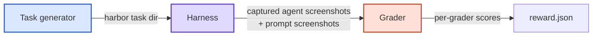
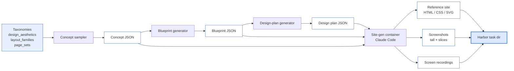

# Overview

## Three subsystems

```mermaid
flowchart LR
    TG[Task generator]
    HN[Harness]
    GR[Grader]

    TG -- harbor task dir --> HN
    HN -- captured agent screenshots<br/>+ prompt screenshots --> GR
    GR -- per-grader scores --> OUT[reward.json]

    style TG fill:#dbe8ff,stroke:#3060c0,stroke-width:2px
    style HN fill:#e0d8ff,stroke:#6040c0,stroke-width:2px
    style GR fill:#ffe0d8,stroke:#c05030,stroke-width:2px
```

## Task generator

```mermaid
flowchart LR
    IN[Taxonomies<br/>design_aesthetics<br/>layout_families<br/>page_sets]

    IN --> S[Concept sampler]
    S --> C[Concept JSON]

    C --> B[Blueprint generator]
    B --> BP[Blueprint JSON]

    BP --> D[Design-plan generator]
    D --> DP[Design plan JSON]

    DP --> SG[Site-gen container<br/>Claude Code]
    BP --> SG
    C --> SG
    SG --> RS[Reference site<br/>HTML / CSS / SVG]
    SG --> SH[Screenshots<br/>tall + slices]
    SG --> SR[Screen recordings]

    RS --> HT[Harbor task dir]
    SH --> HT
    SR --> HT

    style IN fill:#e8f0ff,stroke:#3060c0
    style C fill:#fff,stroke:#3060c0
    style BP fill:#fff,stroke:#3060c0
    style DP fill:#fff,stroke:#3060c0
    style RS fill:#fff,stroke:#3060c0
    style SH fill:#fff,stroke:#3060c0
    style SR fill:#fff,stroke:#3060c0
    style HT fill:#dbe8ff,stroke:#3060c0,stroke-width:2px
```
