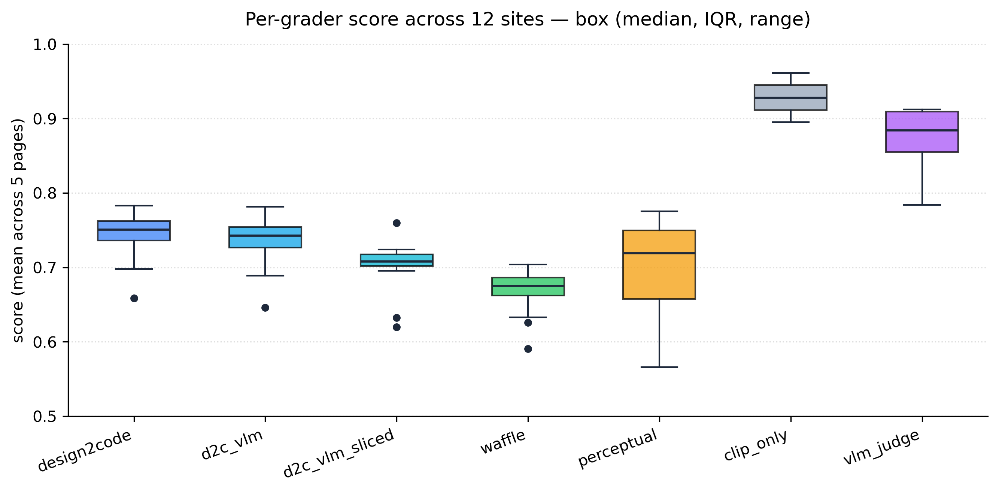
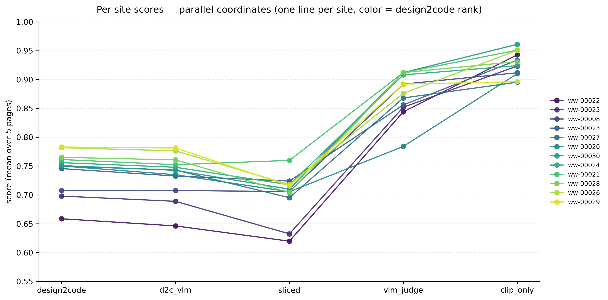
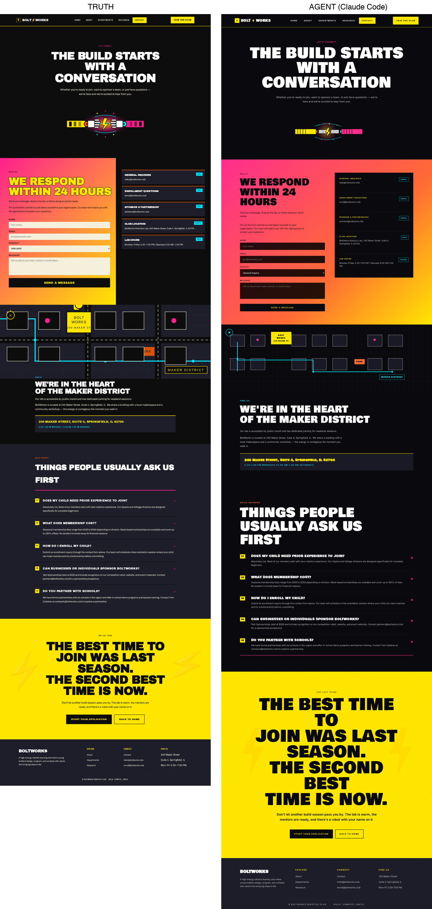
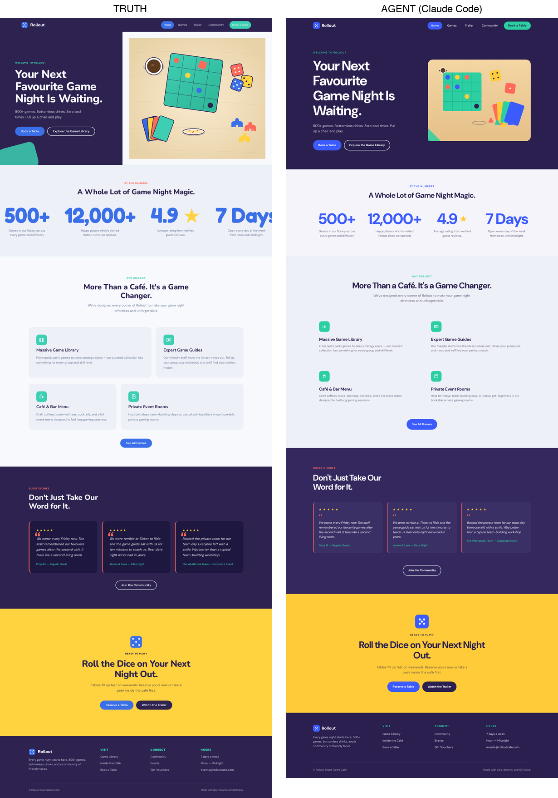

# Part 1: graders we tried

Seven graders. Each one looks at two images — what the agent built and
the original — and outputs a single number from 0 to 1. Higher = closer
to the original.

## What each grader tests

| Grader | What it looks at | API cost |
|---|---|---|
| `design2code` | Are the same boxes (cards, sections, illustrations) in the same places, with the same colors and contents? | none |
| `design2code_vlm` | Same as above, but instead of using CLIP to ask "is this the same kind of page?", we ask Claude to score it on 10 things (layout, color, typography, etc.). | 1 Claude vision call per page |
| `design2code_vlm_sliced` | Same as `design2code_vlm`, but we cut both pages into screen-sized slices and check each slice separately, then average. Helps catch "this part is fine, that part is broken". | 1 Claude vision call per page |
| `waffle` | `design2code` plus one extra check (CW-SSIM) that's tolerant of small shifts. | none |
| `perceptual` | Pure pixel-similarity. Just SSIM + LPIPS, nothing structural. | none |
| `clip_only` | One number from CLIP. Asks "are these images about the same thing?" but doesn't care where anything is. | none |
| `vlm_judge` | Hand the two images to Claude with a 10-criterion rubric and ask for a 1-5 score on each. Mean is the final score. | 1 Claude vision call per page |

## Pseudo-code per grader

Each grader returns a value in `[0, 1]`. Components are also each in
`[0, 1]`. `mean(...)` is plain arithmetic mean.

### `design2code`

```
boxes_truth = find_blocks(truth_image)            # OCR + edge detection
boxes_agent = find_blocks(agent_image)
pairs       = hungarian_match(boxes_truth, boxes_agent)   # best 1-to-1 pairing

block_match = sum(area_of_matched_truth_boxes) / sum(area_of_all_truth_boxes)
text        = mean over pairs of: dice_coefficient(ocr_text(t), ocr_text(a))
position    = 1 - mean over pairs of: distance_between_centers / image_diagonal
color       = 1 - mean over pairs of: per_pixel_color_distance / 30
block_ssim  = area_weighted mean over pairs of: SSIM(crop(t), resized_crop(a))
edge_ssim   = SSIM(canny_edges(truth), canny_edges(agent))
clip        = (cosine_similarity(CLIP_embed(truth), CLIP_embed(agent)) + 1) / 2

score = mean(block_match, text, position, color, block_ssim, edge_ssim, clip)
```

### `design2code_vlm`

```
# same first six components as design2code
block_match, text, position, color, block_ssim, edge_ssim = design2code(...)

# replace the CLIP component with the VLM judge's overall score
vlm = vlm_judge(truth_image, agent_image).score    # see vlm_judge below

score = mean(block_match, text, position, color, block_ssim, edge_ssim, vlm)
```

### `design2code_vlm_sliced`

```
truth_slices = slice_into_viewports(truth_image)   # 1440x1000 each
agent_slices = slice_into_viewports(agent_image)

# per-slice scoring of the design2code components
for each (t_slice, a_slice) in pairs of slices:
    bm, tx, po, co, bs, es = design2code_components(t_slice, a_slice)

block_match = mean of bm across slices
text        = mean of tx across slices
position    = mean of po across slices
color       = mean of co across slices
block_ssim  = mean of bs across slices
edge_ssim   = mean of es across slices

# VLM still runs once on the full tall image (page-level question)
vlm = vlm_judge(truth_image, agent_image).score

score = mean(block_match, text, position, color, block_ssim, edge_ssim, vlm)
```

### `waffle`

```
# all seven design2code components
b, t, p, c, bs, es, cl = design2code_components(...)

# add CW-SSIM (translation-tolerant structural similarity, via piq.haarpsi)
cw_ssim = haarpsi(truth_image, agent_image)

score = mean(b, t, p, c, bs, es, cl, cw_ssim)
```

### `perceptual`

```
ssim_score  = SSIM(truth, agent)                   # in [0, 1] for natural images
lpips_dist  = LPIPS(truth, agent)                  # 0 = identical, ~1 = unrelated
lpips_score = 1 - lpips_dist

score = mean(ssim_score, lpips_score)
```

### `clip_only`

```
cos = cosine_similarity(CLIP_embed(truth), CLIP_embed(agent))   # in [-1, 1]
score = (cos + 1) / 2                                            # rescale to [0, 1]
```

### `vlm_judge`

```
prompt = "Compare these two screenshots on 10 criteria.
          Score each from 1 (very different) to 5 (essentially identical).
          Criteria: layout fidelity, color accuracy, typography hierarchy,
          spacing and rhythm, component structure, asset placement,
          text content fidelity, visual polish, semantic correctness,
          overall similarity."

response = claude.vision(truth_image, agent_image, prompt)   # JSON
                                                              # with 10 numbers + reasons

score = mean(response.scores) / 5                # rescale 1..5 -> 0..1
```

## Analysis on real Claude-Code runs

We scored Claude Code (Opus 4.7) on 12 generated sites (ww-00008 plus
ww-00020 through ww-00030, skipping ww-00031). One run per site, all
five pages of each site, all seven graders. **n = 12 sites × 7 graders
× 5 pages = 420 grader/page scores.** Setup is intentionally boring:
same agent, same model, same harness, same graders — only the site
changes.

### How each grader scored on average

| Grader | mean | std | min | max |
|---|---|---|---|---|
| `design2code` | **0.742** | 0.037 | 0.659 | 0.783 |
| `design2code_vlm` | 0.735 | 0.038 | 0.646 | 0.781 |
| `design2code_vlm_sliced` | **0.701** | 0.038 | 0.620 | 0.760 |
| `waffle` | 0.667 | 0.034 | 0.591 | 0.704 |
| `perceptual` | 0.691 | **0.078** | 0.566 | 0.776 |
| `clip_only` | 0.928 | **0.021** | 0.895 | 0.961 |
| `vlm_judge` | 0.876 | 0.038 | 0.784 | 0.912 |



Box plot: each box covers the middle half of the 12 site means
(25th-75th percentile), the line inside is the median, whiskers
stretch to min/max, and any dots outside the whiskers are sites that
look like outliers.

Two extremes worth flagging:

- `clip_only` sits at mean 0.928 with all 12 sites packed into a tiny
  band near the top — almost everything looks great to it, regardless
  of whether the page is actually right. Compressed range,
  near-useless for ranking.
- `perceptual` has the widest spread (std 0.078) but for the wrong
  reason — it's mostly reacting to whitespace and background colors,
  not whether the page is structurally correct.

The `design2code` family lands in the useful middle: enough range to
separate sites, low enough variance that the differences are real,
not noise.

### Per-site scores (12 sites)



One line per site. Each line connects that site's score on the five
graders, left to right. Line color follows the site's rank on
`design2code` (yellow = highest, purple = lowest), so you can read
"does this site stay near the top across all graders?" by following
one color all the way across.

What jumps out:

- **Big step up between `sliced` and `vlm_judge`.** Every site climbs
  ~0.15 points there. The VLM rubric and CLIP both score the same
  pages much higher than the structural graders do. This is the
  "structural graders penalize hard, semantic graders are lenient"
  pattern, visible in one figure.
- **`clip_only` is the highest band.** All 12 sites are crammed
  between ~0.89 and ~0.96 — confirms the "compressed range" issue.
- **Lines cross between graders.** Where the lines re-order, the
  graders disagree on ranking. The biggest re-ordering happens between
  `sliced` and `vlm_judge` (sites that look bad to the structural
  graders are not necessarily the same sites that look bad to Claude).
- **ww-00022** (dark purple) sits at the bottom of the structural
  graders but climbs into mid-pack for `vlm_judge` and `clip_only` —
  the structural graders agree it's the worst, the semantic graders
  don't see it that way.

Hardest site (across the structural graders): **ww-00022**.
Easiest: **ww-00029** / **ww-00026** / **ww-00028**.
The 0.12-point gap between hardest and easiest is real — Claude Code
is genuinely better on some site designs than others, and the graders
detect that gap rather than smoothing it away.

### Do the graders agree on which site is best?

Spearman rank correlation between graders. 1.00 = identical ranking,
0.00 = totally different ranking, -1.00 = inverted ranking.

| | design2code | d2c_vlm | sliced | waffle | perceptual | vlm_judge | clip_only |
|---|---|---|---|---|---|---|---|
| design2code | — | **0.98** | 0.56 | **0.99** | 0.59 | 0.64 | 0.10 |
| d2c_vlm | 0.98 | — | 0.52 | 0.97 | 0.52 | 0.64 | 0.01 |
| sliced | 0.56 | 0.52 | — | 0.57 | 0.49 | 0.43 | 0.39 |
| waffle | 0.99 | 0.97 | 0.57 | — | 0.63 | 0.63 | 0.15 |
| perceptual | 0.59 | 0.52 | 0.49 | 0.63 | — | 0.29 | 0.36 |
| vlm_judge | 0.64 | 0.64 | 0.43 | 0.63 | 0.29 | — | 0.36 |
| clip_only | 0.10 | 0.01 | 0.39 | 0.15 | 0.36 | 0.36 | — |

Three things jump out:

1. **`design2code`, `design2code_vlm`, and `waffle` all rank sites
   the same way** (ρ ≥ 0.97). They argue about the *number* but not
   about which site is better than which. Implication: if you only
   care about ranking, plain `design2code` is enough; the extra cost
   of the VLM hybrid and the extra cost of CW-SSIM aren't buying new
   ranking information.
2. **`design2code_vlm_sliced` ranks sites genuinely differently**
   (ρ ≈ 0.52 with d2c_vlm). Per-slice scoring penalizes "one bad
   section in an otherwise fine page" much harder than page-level
   averaging does. This is real complementary signal — keep it.
3. **`clip_only` is essentially independent of the structural graders
   (ρ = 0.10 with `design2code`).** CLIP is sorting sites by what
   *kind of page* they are, not whether they were built correctly.
   Confirms the perverse-incentive failure mode the literature warned
   about, on real agent output.

### Where Claude is weakest (component-level breakdown)

`design2code` averages across its seven components on the 12 sites:

| component | mean | std | what it's checking |
|---|---|---|---|
| position | 0.951 | 0.012 | are matched blocks centered in the right spot |
| clip | 0.928 | 0.034 | does the page look like the right *kind* of page |
| block_match | 0.894 | 0.123 | did we find the same blocks at all |
| edge_ssim | 0.783 | 0.044 | are the outlines (text shapes, borders) similar |
| **text** | **0.567** | 0.094 | do the matched blocks contain the same words |
| **color** | **0.565** | 0.124 | do the matched blocks use the same colors |
| **block_ssim** | **0.509** | 0.083 | do the matched blocks render similarly inside |

The three lowest — text, color, block_ssim — line up with what we see
when reviewing Claude Code's output by eye: **fonts are off, colors
are off, illustrations are off.** The components correctly point at
the failure axes; they don't compress everything to a single
indistinguishable number.

Position and CLIP are consistently high (0.95, 0.93) — Claude gets
section *positions* and overall page *type* right. Where it fails is
within-block fidelity, which v1 graders were blind to.

### Worked example: where the graders disagree most

The lowest-scoring page on `waffle` across the 12 sites is **ww-00022 /
page_05** (a contact page from a fictional brand "BoltWorks"). Same
page, scored by every grader:

| grader | score |
|---|---|
| `waffle` | **0.551** ← lowest |
| `design2code` v2 | 0.614 |
| `design2code_vlm_sliced` | 0.654 |
| `vlm_judge` | 0.860 |
| `clip_only` | 0.914 |



**Truth (left)** vs **agent's render (right)**. Eyeball check: same
hero headline, same yellow-and-red gradient form, same dark contact
card on the right, same map illustration, same "things people usually
ask us first" FAQ block, same yellow CTA, same footer. The agent's
version differs in three small ways:

- the map illustration has fewer nodes / a simpler track,
- the FAQ items are numbered "01, 02, 03..." (the truth isn't),
- the rendered page is ~16% taller (more vertical whitespace).

A human looking at this would probably say "yes, same page, ~80%
right". `vlm_judge` (0.860) and `clip_only` (0.914) agree.

**Why `waffle` says 0.551:** the height mismatch wrecks `cw_ssim`
(the wavelet metric collapses to 0.115 because every coefficient is
at a shifted vertical position). On a tall multi-section page that
also confuses the page-level `block_match` (0.455 — the matcher
mismatches similar-looking dark cards across the page), which
cascades into bad `block_ssim` (0.391), `color` (0.369), and `text`
(0.462). Eight components, one of them in the floor (`cw_ssim`),
others poisoned by upstream matching errors → mean 0.551.

**Why `design2code_vlm_sliced` says 0.654:** no `cw_ssim` component
at all, and the page is sliced into 1440×1000 viewports before
matching. Each viewport in the agent is matched against the *same*
viewport in the truth, so the matcher recovers — `block_match` jumps
from 0.455 → 0.682, `text` from 0.462 → 0.628. The VLM rubric on
the full image floats in another 0.840.

**Take-away:** `waffle` over-punishes long pages where the agent
rendered the right content slightly stretched. `design2code_vlm_sliced`
and `vlm_judge` correctly score this as "mostly right". For RL reward,
this is the failure mode that matters — you don't want the reward to
crash on a near-correct attempt because of a height mismatch.

### Worked example: where sliced rates an attempt highest

The highest-scoring page on `design2code_vlm_sliced` across the 12
sites is **ww-00021 / page_01** — the homepage of a fictional board
game café "Rollout". Same page, every grader:

| grader | score |
|---|---|
| `clip_only` | 0.957 |
| `vlm_judge` | 0.880 |
| `design2code_vlm_sliced` | **0.796** ← highest sliced score in the corpus |
| `design2code` v2 | 0.715 |
| `waffle` | 0.643 |



Same exercise: eyeball the two screenshots. Same hero headline ("Your
Next Favourite Game Night Is Waiting"), same dark-purple → cream
hero, same "By the Numbers" stats row (500+, 12,000+, 4.9, 7 Days),
same 4-card "More Than a Café" grid (Massive Game Library / Expert
Game Guides / Café & Bar Menu / Private Event Rooms), same dark
testimonials section with three quote cards, same yellow CTA, same
footer. The only meaningful difference is the **hero illustration**:
the truth has a detailed scene (board, dice, cards, meeples, coffee
cup) and the agent has a simplified version (board + dice + cards,
no meeples, no coffee cup, slightly different palette).

A human would say "this is essentially correct, with one section
slightly less detailed". `clip_only` (0.957), `vlm_judge` (0.880)
and `design2code_vlm_sliced` (0.796) all land in the right
neighborhood.

**Why `waffle` still says 0.643:** the same `cw_ssim` failure mode
shows up — `cw_ssim = 0.139` on this page (the heights only differ
by 2.6%, but the wavelet metric is sensitive to even modest
translation). On top of that, the page-level `block_match = 0.605`
because the simplified hero illustration changes the bounding-box
structure, which throws the global Hungarian matcher and cascades
into `color = 0.499`, `text = 0.597`.

**Why `design2code_vlm_sliced` lands at 0.796:** per-slice matching
isolates the hero into its own viewport, where the matcher only
needs to align "headline block + illustration block" rather than
the whole page. That recovers `block_match` from 0.605 → 0.934.
`text` recovers from 0.597 → 0.767 once the OCR'd content is paired
correctly. Plus no `cw_ssim` to drag it down.

**Take-away on the bright side:** sliced isn't *just* about avoiding
waffle's failure modes. When the agent is genuinely close, sliced
correctly says "0.8 — pretty good" while waffle still penalizes for
~0.15. This is the exact behaviour you want from an RL reward: high
when the attempt is close, lower when it's far. Compressed scores
(`clip_only` saying 0.957 for a page that's ~80% right) and
brittle-low scores (`waffle` saying 0.643) both fail this test in
opposite directions; sliced threads the needle.

### What this means for picking a grader

| Grader | Verdict |
|---|---|
| `design2code` v2 | Free, ~5s/page, mean 0.742. **Best speed/quality tradeoff. Use as primary.** |
| `design2code_vlm` | +1 Claude vision call. Almost identical ranking to v2 (ρ 0.98). **Drop or keep as a sanity check.** |
| `design2code_vlm_sliced` | +1 Claude vision call. Genuinely different ranking (ρ 0.52). **Keep — complementary signal, useful for tighter RL gradients.** |
| `waffle` | Almost identical to v2 (ρ 0.99). **Pure duplication. Keep only as a baseline.** |
| `perceptual` | Most unstable across sites (std 0.078) and reacts to the wrong things. **Baseline only.** |
| `clip_only` | Independent of structural correctness. **Baseline only — never use as RL reward.** |
| `vlm_judge` | Genuine new signal (ρ 0.64), but compresses everything above 0.78. **Diagnostic / offline-only, not RL reward.** |

### What's *not* in this section

- **Within-task variance.** We have n=1 per site here. Whether
  re-running Claude Code on the same site produces a tight or wide
  spread is the *next* experiment — n=10 same-task variance run, in
  progress on `ww-00022/attempt-002`.
- **Whether 0.742 is "right".** The graders agree internally, but
  internal agreement isn't ground truth. A small human study would
  pin down whether the absolute level is well-calibrated.
- **Why ww-00022 scores lowest.** Eyeball needed.

## Glossary

Just the technical terms that appear above, in plain words.

- **SSIM** (Structural Similarity Index): a number that says how
  similar two images look at the pixel level. It compares small
  windows of pixels and asks "is the brightness, contrast, and texture
  similar in this patch?" Then averages across all patches. 1 means
  identical, 0 means unrelated.
- **LPIPS** (Learned Perceptual Image Patch Similarity): a neural net
  trained on what humans say "looks alike". Outputs a *distance*: 0 if
  the images look the same to a person, larger if they look different.
  We flip it to a similarity by `1 - distance`.
- **CLIP**: a model that encodes any image into a vector capturing its
  *meaning* ("a contact page", "a pricing page"). Two images with
  similar meaning have similar vectors. We compare those vectors with
  cosine similarity.
- **CIEDE2000**: a color-distance formula that matches how humans
  perceive color differences. Two reds that look the same to a person
  give a small CIEDE2000; red vs green gives a big one.
- **Hungarian matching**: an algorithm that finds the best 1-to-1
  pairing between two sets of items (here: blocks in the truth image
  and blocks in the agent image), minimizing total "cost" of the
  matches.
- **OCR** (Optical Character Recognition): software that reads text
  out of an image. We use it to compare the text inside matched blocks.
- **Canny edges**: a classical algorithm that turns an image into a
  black-and-white outline showing where the edges are. Useful because
  edge maps are dominated by typography and component shapes, not
  large flat backgrounds.
- **Sørensen-Dice coefficient on bigrams**: a way to measure how
  similar two strings are. Break each string into pairs of letters
  ("hello" → {he, el, ll, lo}), then `2 × |overlap| / (|set A| + |set
  B|)`. 1 means identical, 0 means no shared letter pairs.
- **CW-SSIM** (Complex-Wavelet SSIM, here approximated by `piq.haarpsi`):
  like SSIM but tolerant of small translations. A page shifted 5 pixels
  to the right gets a much higher CW-SSIM than plain SSIM.
- **Cosine similarity**: how similar two vectors point in the same
  direction. 1 = same direction, 0 = perpendicular, -1 = opposite.
  We rescale to `[0, 1]` with `(cos + 1) / 2`.
